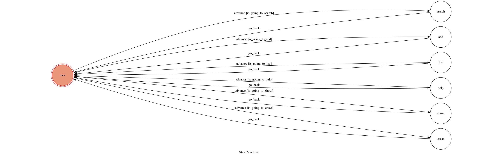

# TOC Project 2020 - Time Zone Converter

[//]: #([](https://codeclimate.com/github/NCKU-CCS/TOC-Project-2020/maintainability))

[//]: #([](https://snyk.io/test/github/NCKU-CCS/TOC-Project-2020))

A Line bot based on a finite state machine.

The Line bot allows you to search for the specific time/date in different time zones.

## Finite State Machine



## Usage

The initial state is set to `user`.

Every time `user` state is triggered to `advance` to another state, it will `go_back` to `user` state after the bot replies a corresponding message.

The default tracked time zone is `Asia/Taipei`.

* `list`: List tracked time zones with current time.
    ```
    input:
        search all
    reply:
        Asia/Taipei
        2019-12-09 13:25:36
    ```
* `search [option]`: List all avaliable time-zone.
    * `all`: List first level.
        ```
        input:
            search all
        reply:
            Africa/
            America/
            ...
            Brazil/
            ...
            Zulu
        ```
    * `region`: Unfold certain region (listed with `/` at the end in `all` option).
        ```
        input:
            search Asia
        reply:
            Asia/Aden
            Asia/Almaty
            Asia/Amman
            ...
            Asia/Yerevan
        ```
* `add [time-zone]`: Add time zone.
    * `time-zone`: Avaliable time zones are listed by `search` command.
        ```
        input:
            add Tokyo
        reply:
            Add Tokyo success!
            Tracking:
            Asia/Taipei
            Asia/Tokyo
        ```
    *  Here we accept substrings.
        ```
        input:
            add US
        reply:
            Add US success!
            Tracking:
            Asia/Taipei
            Asia/Tokyo
            US/Alaska
            US/Aleutian
            ...
            US/Samoa
        ```
* `show [time-zone]&[%Y-%m-%d %H:%M:%S]`: Show specific time.
    * `%Y-%m-%d %H:%M:%S` is the time format.
        ```
        input:
            show US/Eastern&2019-12-09 12:35:08
        reply:
            Asia/Taipei
            2019-12-10 01:31:08
            Asia/Tokyo
            2019-12-10 02:31:08
        ```
* `erase [option]`: Erase some or all tracked time zones.
    * `time-zone`: Remove certain time zone. The machine also accepts substrings.
        ```
        input:
            erase Tokyo
        reply:
            Erase success!
            Tracking:
            Asia/Taipei
            US/Alaska
            US/Aleutian
            ...
            US/Samoa
        ```
    * `all`: Reset to default.
        ```
        input:
            erase all
        reply:
            Erase success!
            Tracking:
            Asia/Taipei
        ```
* `help`: Get usage information.
    ```
    input:
        help
    reply:
        Usage:
        - list: List tracked time zones with current time.
        - search [option]: List all avaliable time-zone.
        ---- all: List first level
        ---- region: Unfold certain region, e.g. US.
        - add [time-zone]: Add time zone.
        - show [time-zone]&[%Y-%m-%d %H:%M:%S]: Show specific time.
        ---- %Y-%m-%d %H:%M:%S is the time format
        - erase [option]: Erase some or all tracking time zones
        ---- time-zone: Remove certain region or time zone.
        ---- all: Reset to default.
        - help: Get this message again.
    ```

## Setup

### Prerequisite

* Python 3.6
* Pipenv
* [Line Developers](https://developers.line.biz/zh-hant/)
* [Heroku](https://signup.heroku.com/)/AWS

#### Install Dependency

```sh
pip3 install pipenv

pipenv --three

pipenv install

pipenv shell
```

* `pygraphviz` (For visualizing Finite State Machine)
    * [Setup pygraphviz on Ubuntu](http://www.jianshu.com/p/a3da7ecc5303)
	* [Note: macOS Install error](https://github.com/pygraphviz/pygraphviz/issues/100)


#### Secret Data
You should generate a `.env` file to set Environment Variables refer to our `.env.sample`.
`LINE_CHANNEL_SECRET` and `LINE_CHANNEL_ACCESS_TOKEN` **MUST** be set to proper values.
Otherwise, you might not be able to run your code.

## Deploy
Setting to deploy webhooks on Heroku.

### Heroku CLI installation

* [macOS, Windows](https://devcenter.heroku.com/articles/heroku-cli)

or you can use Homebrew (MAC)
```sh
brew tap heroku/brew && brew install heroku
```

or you can use Snap (Ubuntu 16+)
```sh
sudo snap install --classic heroku
```

### Connect to Heroku

1. Register Heroku: https://signup.heroku.com

2. Create Heroku project from website

3. CLI Login

	```sh
    heroku login
    ```

### Upload project to Heroku

1. Add local project to Heroku project

	```sh
    heroku git:remote -a {HEROKU_APP_NAME}
    ```

2. Upload project

	```sh
	git add .
	git commit -m "Add code"
	git push -f heroku master
	```

3. Set Environment - Line Messaging API Secret Keys

	```sh
	heroku config:set LINE_CHANNEL_SECRET={your_line_channel_secret}
	heroku config:set LINE_CHANNEL_ACCESS_TOKEN={your_line_channel_access_token}
	```

4. Your Project is now running on Heroku!

	url: `{HEROKU_APP_NAME}.herokuapp.com/webhook`

	debug command: `heroku logs --tail --app {HEROKU_APP_NAME}`

5. If fail with `pygraphviz` install errors

	run commands below can solve the problems
	```sh
	heroku buildpacks:set heroku/python
	heroku buildpacks:add --index 1 heroku-community/apt
	```

	Reference: [2018 FAQ Q2](https://hackmd.io/@ccw/B1Xw7E8kN?type=view#Q2-如何在-Heroku-使用-pygraphviz)

## Reference

[Pipenv](https://medium.com/@chihsuan/pipenv-更簡單-更快速的-python-套件管理工具-135a47e504f4) ❤️ [@chihsuan](https://github.com/chihsuan)

[TOC-Project-2019](https://github.com/winonecheng/TOC-Project-2019) ❤️ [@winonecheng](https://github.com/winonecheng)

Flask Architecture ❤️ [@Sirius207](https://github.com/Sirius207)

[Line line-bot-sdk-python](https://github.com/line/line-bot-sdk-python/tree/master/examples/flask-echo)

[2020 TOC Project Slides](https://hackmd.io/@TTW/ToC-2019-Project#)

[2018 TOC Project FAQ](https://hackmd.io/s/B1Xw7E8kN)
